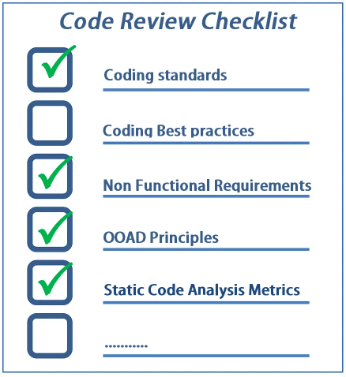
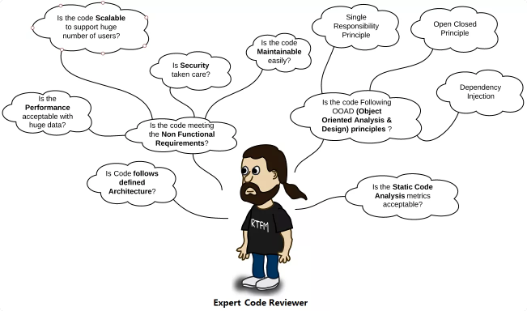

> https://www.evoketechnologies.com/blog/code-review-checklist-perform-effective-code-reviews/

In my previous blog post, we discussed about “10 Simple Code Review Tips for Effective Code Reviews”. Now, let’s take this topic further and explore the code review checklist, which would help to perform effective code reviews to deliver best quality software. 

This code review checklist also helps the code reviewers and software developers (during self code review) to gain expertise in the code review process, as these points are easy to remember and follow during the code review process. 

Let’s first begin with the basic code review checklist and later move on to the detailed code review checklist. 
<!--more-->
### Basic Code Review Checklist
Let’s discuss about the basic code review checklist, which can be very handy if you are a beginner in code reviews and/or during initial code reviews.

While reviewing the code, ask yourself the following basic questions:

- Am I able to understand the code easily?
- Is the code written following the coding standards/guidelines?
- Is the same code duplicated more than twice?
- Can I unit test / debug the code easily to find the root cause?
- Is this function or class too big? If yes, is the function or class having too many responsibilities?
- If you feel that the answer is not satisfactory to any of the above questions, then you can suggest/recommend code changes.

### Detailed Code Review Checklist
The following code review checklist gives an idea about the various aspects you need to consider while reviewing the code:

#### Code formatting

While going through the code, check the code formatting to improve readability and ensure that there are no blockers:

a) Use alignments (left margin), proper white space. Also ensure that code block starting point and ending point are easily identifiable.

b) Ensure that proper naming conventions (Pascal, CamelCase etc.) have been followed. 

c) Code should fit in the standard 14 inch laptop screen.  There shouldn’t be a need to scroll horizontally to view the code. In a 21 inch monitor, other windows (toolbox, properties etc.) can be opened while modifying code, so always write code keeping in view a 14 inch monitor.

d) Remove the commented code as this is always a blocker, while going through the code. Commented code can be obtained from Source Control (like SVN), if required.

#### Architecture
a) The code should follow the defined architecture.

Separation of Concerns followed
Split into multiple layers and tiers as per requirements (Presentation, Business and Data layers).
Split into respective files (HTML, JavaScript and CSS).
Code is in sync with existing code patterns/technologies.
Design patterns: Use appropriate design pattern (if it helps), after completely understanding the problem and context.

#### Coding best practices
No hard coding, use constants/configuration values.
Group similar values under an enumeration (enum).
Comments – Do not write comments for what you are doing, instead write comments on why you are doing. Specify about any hacks, workaround and temporary fixes. Additionally, mention pending tasks in your to-do comments, which can be tracked easily.
Avoid multiple if/else blocks.
Use framework features, wherever possible instead of writing custom code.

#### Non Functional requirements
a) Maintainability (Supportability) – The application should require the least amount of effort to support in near future. It should be easy to identify and fix a defect.

Readability: Code should be self-explanatory. Get a feel of story reading, while going through the code. Use appropriate name for variables, functions and classes. If you are taking more time to understand the code, then either code needs refactoring or at least comments have to be written to make it clear.
Testability: The code should be easy to test. Refactor into a separate function (if required). Use interfaces while talking to other layers, as interfaces can be mocked easily. Try to avoid static functions, singleton classes as these are not easily testable by mocks.
Debuggability: Provide support to log the flow of control, parameter data and exception details to find the root cause easily. If you are using Log4Net like component then add support for database logging also, as querying the log table is easy.
Configurability: Keep the configurable values in place (XML file, database table) so that no code changes are required, if the data is changed frequently.
b) Reusability

DRY (Do not Repeat Yourself) principle: The same code should not be repeated more than twice.
Consider reusable services, functions and components.
Consider generic functions and classes.
c) Reliability – Exception handling and cleanup (dispose) resources.

d) Extensibility – Easy to add enhancements with minimal changes to the existing code. One component should be easily replaceable by a better component.

e) Security – Authentication, authorization, input data validation against security threats such as SQL injections and Cross Site Scripting (XSS), encrypting the sensitive data (passwords, credit card information etc.)

f) Performance

Use a data type that best suits the needs such as StringBuilder, generic collection classes.
Lazy loading, asynchronous and parallel processing.
Caching and session/application data.
g) Scalability – Consider if it supports a large user base/data? Can this be deployed into web farms?

h) Usability – Put yourself in the shoes of a end-user and ascertain, if the user interface/API is easy to understand and use. If you are not convinced with the user interface design, then start discussing your ideas with the business analyst.

#### Object-Oriented Analysis and Design (OOAD) Principles
Single Responsibility Principle (SRS): Do not place more than one responsibility into a single class or function, refactor into separate classes and functions.
Open Closed Principle: While adding new functionality, existing code should not be modified. New functionality should be written in new classes and functions.
Liskov substitutability principle: The child class should not change the behavior (meaning) of the parent class. The child class can be used as a substitute for a base class.
Interface segregation: Do not create lengthy interfaces, instead split them into smaller interfaces based on the functionality. The interface should not contain any dependencies (parameters), which are not required for the expected functionality.
Dependency Injection: Do not hardcode the dependencies, instead inject them.
In most cases the principles are interrelated, following one principle automatically satisfies other principles. For e.g: if the ‘Single Responsibility Principle’ is followed, then Reusability and Testability will automatically increase.

In a few cases, one requirement may contradict with other requirement. So need to trade-off based on the importance of the weight-age, e.g. Performance vs Security. Too many checks and logging at multiple layers (UI, Middle tier, Database) would decrease the performance of an application. But few applications, especially relating to finance and banking require multiple checks, audit logging etc. So it is ok to compromise a little on performance to provide enhanced security.

### Tools for Code Reviews
The first step while assessing the code quality of the entire project is through a static code analysis tool. Use the tools (based on technology) such as SonarQube, NDepend, FxCop, TFS code analysis rules. There is a myth that static code analysis tools are only for managers.
Use plug-ins such as Resharper, which suggests the best practices in Visual studio.
To track the code review comments use the tools like Crucible, Bitbucket and TFS code review process.
### Conclusion
The above code review checklist is not exhaustive, but provides a direction to the code reviewer to conduct effective code reviews and deliver good quality code. Initially, it would take some time to review the code from various aspects. After a bit of practice, code reviewers can perform effective code reviews, without much effort and time. If you would like to become an expert code reviewer, this code review checklist serves as a great starting point. Happy Code Reviewing!
