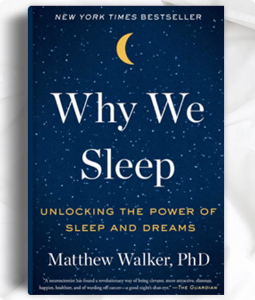

> 转自 https://www.gatesnotes.com/Books/Why-We-Sleep

### 曾经年少爱追梦
在微软早期，当我们不得不交付一款软件时，我通常会熬夜加班，有一两次连续熬了两个晚上。我知道我并没有那么厉害，主要依靠咖啡因和肾上腺素支持，不过当时我迷上了自己的工作，觉得睡太多觉是懒的表现。

<!--more-->

### 关于这本书
最近读过Matthew Walker的《为什么睡觉》这本书后，我意识到所有的熬夜工作(几乎都不足8小时的睡眠)都会付出巨大的代价。这本书是我的女儿Jenn和John Doerr(“风险投资之王”)推荐给我的。

Walker是加州大学伯克利分校人类睡眠科学中心主任，他在书里解释了忽视睡眠如何削弱你的创造力、解决问题能力、决策、学习、记忆力、心脏健康、脑部健康、心理健康、情绪健康、免疫系统甚至你的寿命，书中提到"整个工业化国家睡眠的减少正在带来灾难性的影响"。

### 读后感FAQ
对于他书中的观点我不一定会照单全收，例如他声称睡眠不足与阿尔茨海默氏症之间存在紧密联系，另外为了使我们所有人意识到睡眠不足的危害，他有时会使用科学尚未证实的东西。

但不管怎么说，《为什么睡觉》是一本重要而有趣的书。这只是一篇简短的评论，所以我将回答一些我认为对你来说最重要的问题。

#### 是否每个人都需要一天7或8小时的睡眠？
答案是肯定的，你几乎肯定会这样做，即使你已经说服自己不这样做。用底特律亨利·福特医院的托马斯·罗斯博士的话来说，“能在不超过5小时的睡眠中存活下来且没有受到损害的人数为零。”

#### 我们为什么要睡觉？
毕竟，在睡觉时（所有动物也一样），你无法狩猎、采集、饮食、繁殖或保护自己。然而，Walker得出的结论是，睡眠的优点远大于这些缺点。简而言之，睡眠会产生复杂的神经化学反应，从而以各种方式改善我们的大脑。而且，它“补充了我们免疫系统的武器库，有助于抵抗恶性肿瘤，防止感染并防止各种疾病。”换句话说，睡眠极大地增强了我们的进化适应能力，用我们看不到的方式。

#### 我能做些什么来改善我的睡眠质量呢？
- 替换卧室中的所有LED灯泡，因为它们发出的蓝光对睡眠影响很大
- 如果你有幸能够控制自己的居住温度，则可以在打算睡觉时将卧室的温度降至18℃。Walker说，“要成功进入睡眠……你的身体温度需要降低2至3华氏度”
- 限制饮酒，因为喝酒对睡眠没帮助，这和大家普遍的看法相反。 Walker说，虽然喝酒可能有助于诱发睡眠，但“酒精是REM（[快速动眼期](https://zh.wikipedia.org/wiki/%E5%BF%AB%E9%80%9F%E5%8B%95%E7%9C%BC%E6%9C%9F)）的最有力抑制剂之一”
- 如果你可以像我们的祖先以前那样短暂地午睡(一些地中海和南美地区仍这样做)，你应该这么做（但不要晚于下午3点）。它可能会改善您的创造力和冠状动脉健康，并延长您的寿命

### 结语
我花了比平常更长的时间来读完《为什么睡觉》，因为我遵循Walker的建议，比以前习惯更早一点放下书睡觉（这样我可以睡得更好）。Walker教给我很多这种地球上每个人都需要的基本知识，我想他的书对你也会有帮助。